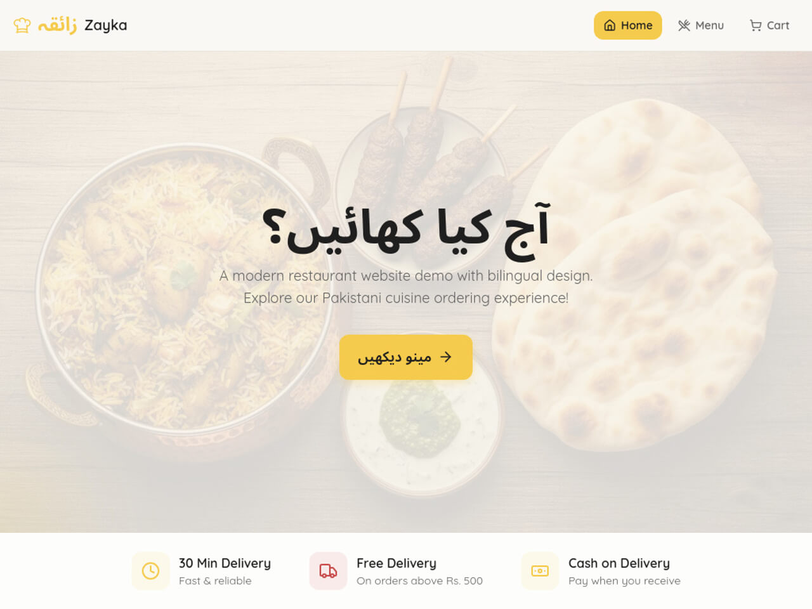

# 🍕 Zayka – Restaurant Demo Website

**Zayka** is a modern **restaurant demo website** with a digital menu, add-to-cart functionality, and **WhatsApp ordering**.  
Built with **React, TypeScript, Vite, TailwindCSS**, and bilingual **Urdu + English** UI. Perfect for **demo, portfolio, and learning purposes**.  

---

## 🚀 Features

- 🥗 **Interactive Digital Menu** – Browse Burgers, Pizza, Biryani & more  
- 🛒 **Cart Functionality** – Add multiple items, review your order  
- 📲 **WhatsApp Ordering** – Send pre-filled orders directly to WhatsApp  
- 🌐 **Bilingual UI** – Urdu + English support  
- 🎨 **Eye-catching Design** – Soft brand colors & ripple click effect  
- ⚡ **Fast & Responsive** – Works on mobile and desktop  
- ⏳ **Loading Screen** – Fun rotating pizza icon while site loads  

---

## 💻 Tech Stack

- **React + TypeScript**  
- **Vite** (fast development + build)  
- **TailwindCSS** (modern UI design)  
- **Lovable** (component scaffolding)  

---

## 📝 Usage

This project is for **demo and educational purposes only**.  
You may **view, study, or reference** the code, but **cannot use it commercially** without permission.  

Visit the live demo: 🌐 [Zayka Demo](https://zayka-restaurant-demo.vercel.app)

---

## ⚡ Author

**Umair Shakoor** – Pakistani Frontend Developer & Systems Builder  
Portfolio: [unseenUmair](https://unseenumair.github.io/)

---

## 📄 License

Copyright © 2026 Umair Shakoor – All rights reserved.  
For personal/educational use only.
